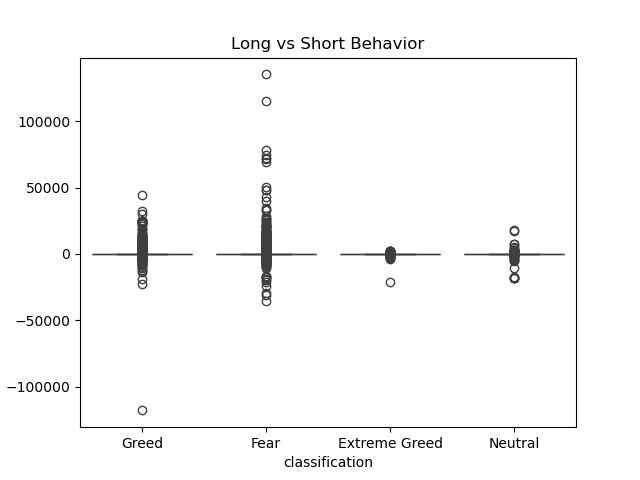
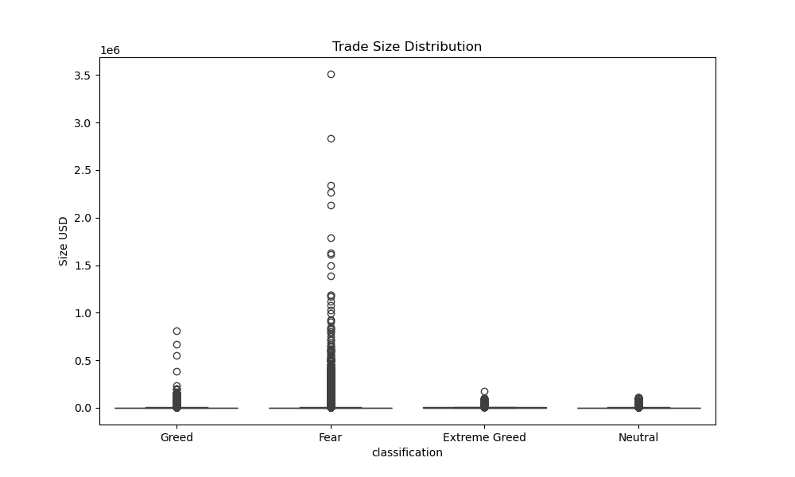
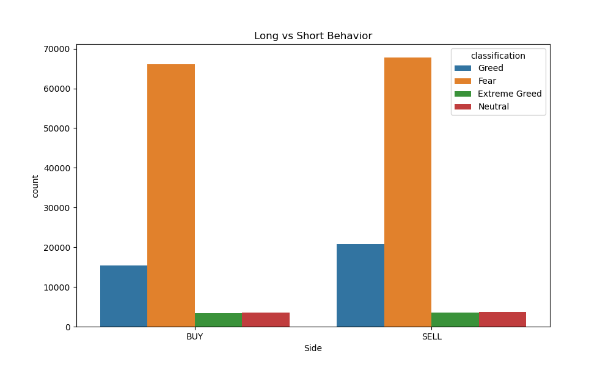

# primetrade-market-sentiment-analysis
Market sentiment analysis of crypto trader behavior using Python, machine learning, and visualization. 
# PrimeTrade Market Sentiment Analysis

## Project Objective
This project analyzes how Bitcoin market sentiment (Fear vs Greed) influences trader behavior, profitability, and trading activity using historical trading data from Hyperliquid and the Bitcoin Fear & Greed Index.

The project focuses on identifying how market sentiment impacts:
- Trader profitability
- Trading frequency
- Position sizing behavior
- Long vs Short bias
- Risk-taking patterns

---

# Datasets Used

## 1. Bitcoin Fear & Greed Index
Contains daily market sentiment classification:
- Fear
- Extreme Fear
- Greed
- Extreme Greed
- Neutral

Columns:
- timestamp
- value
- classification
- date

---

## 2. Hyperliquid Historical Trader Data
Contains trader-level transaction data.

Columns include:
- Account
- Coin
- Execution Price
- Size Tokens
- Size USD
- Side
- Timestamp
- Direction
- Closed PnL
- Fee
- Trade ID

---

# Project Workflow

## Part A — Data Preparation
- Loaded both datasets using Pandas
- Checked:
  - Missing values
  - Duplicate rows
  - Dataset dimensions
- Converted timestamps into daily format
- Merged datasets on common Date column
- Cleaned and formatted numerical columns

---

## Part B — Analysis Performed

### Performance Analysis
- Daily PnL per trader
- Win rate comparison
- Drawdown proxy analysis

### Behavioral Analysis
- Trade frequency analysis
- Average trade size analysis
- Long vs Short behavior
- Risk exposure analysis

### Trader Segmentation
Identified multiple trader segments:
- High-risk vs low-risk traders
- Frequent vs infrequent traders
- Consistent vs inconsistent traders

### Bonus Analysis
- Trader clustering using KMeans
- Predictive modeling using Random Forest Classifier

---

# Key Insights

## Insight 1
Fear periods showed the highest market volatility, with both extreme profits and losses occurring more frequently.

## Insight 2
Traders significantly increased trade sizes during Fear periods, indicating higher risk-taking behavior.

## Insight 3
SELL activity slightly exceeded BUY activity during Fear markets, suggesting more defensive trader positioning.

## Insight 4
Frequent traders reacted more aggressively to market sentiment changes compared to infrequent traders.

---

# Strategy Recommendations

## Strategy 1 — Reduce Risk During Fear Markets
Since Fear periods showed the largest downside volatility, traders should reduce position sizes and apply stricter risk management during high-uncertainty periods.

## Strategy 2 — Use Sentiment-Aware Trading
Market sentiment indicators can be integrated into trading systems to dynamically adjust trading frequency, position sizes, and exposure levels.

---

# Technologies Used

- Python
- Pandas
- NumPy
- Matplotlib
- Seaborn
- Scikit-learn
- Streamlit

--- 
# Sample Visualizations

## PnL Distribution



---

## Trade Size Distribution



---

## Long vs Short Behavior



# Project Structure

```text
primetrade_assignment/
│
├── market_sentiment_analysis.ipynb
├── app.py
├── README.md
├── short_report.md
├── fear_greed_index.csv
├── historical_data.csv
│
├── charts/
│   ├── pnl_distribution.png
│   ├── trade_size_distribution.png
│   └── long_short_behavior.png
How To Run The Project
1. Install Required Libraries
pip install pandas numpy matplotlib seaborn scikit-learn streamlit
2. Run Jupyter Notebook

Open:

market_sentiment_analysis.ipynb
3. Run Streamlit Dashboard
python -m streamlit run app.py
Dashboard Features

The Streamlit dashboard includes:

Merged dataset preview
Market sentiment distribution
Interactive charts 
Trader behavior insights
Conclusion

This project demonstrates how market sentiment significantly influences trader behavior, risk exposure, and profitability in cryptocurrency markets.

The analysis highlights the importance of sentiment-aware trading strategies and dynamic risk management during volatile market conditions.
